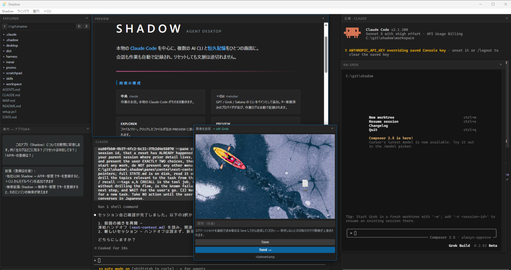

# Shadow — 忘れないAI環境

**The AI environment that never forgets.**

Shadow は Claude Code のためのデスクトップアプリ。本物の `claude` をそのまま画面の中で動かしながら、
会話の記録を裏で丁寧に残し、話題ごとに整理していく——だから、セッションが終わっても文脈は終わらない。
エクスプローラー・エディタ・複数のAIペインが1つのウィンドウに収まり、リセットしても続きから始められる。

Shadow is a desktop app for Claude Code: it hosts the real `claude` while quietly keeping and
organizing every conversation by topic — so the session may end, but the context never does.



- **サイト / Website**: https://onigirito.github.io/ShadowHarness/ （[English](https://onigirito.github.io/ShadowHarness/en/)）
- **X**: [@ShadowHarness](https://x.com/ShadowHarness)

---

このリポジトリは公式サイトのソースです。This repository holds the source of the official website.

```sh
npm install
npm run dev     # ローカルプレビュー / local preview
npm run build   # 静的ビルド / static build
```
